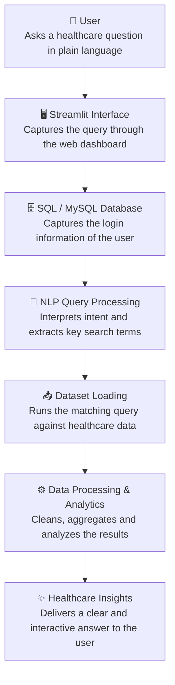

# Hackathon
Hackathon Project
# 🏥 CareCompass – Patient View

CareCompass is a Streamlit web app that helps patients in India find and compare hospitals for a specific disease. Patients can filter by disease, location, hospital type and budget, see hospitals ranked by success rate or treatment cost, view them on an interactive map, and ask an AI healthcare chatbot for help.

`home.py` is the main patient-facing page of the app.

## Features

- **Disease-based search** – pick a disease (default: Dengue) and see only hospitals that treat it.
- **Cascading location filters** – choose a state, then a city. The city list updates based on the selected state and disease.
- **Hospital type filter** – narrow results by type (Government, Private, etc., as found in your data).
- **Budget filter** – set a maximum treatment cost in ₹ (default: ₹2,00,000).
- **Hospital name search** – type part of a name and get live suggestions.
- **Sorting** – sort by **Success Rate** or **Treatment Cost**.
- **Hospital cards** – each card shows the rating, hospital type, city, treatment cost, specialties, number of patients currently being treated, and success rate. Hospitals rated **4.6 or higher** get a "★ Top Rated" badge.
- **Top 3 by default** – click **Show all recommended hospitals** to see the full list.
- **Interactive map** – hospitals are plotted with Folium markers. If a specific city is selected, the map centres on that city (looked up with OpenStreetMap Nominatim).
- **AI healthcare chatbot** – embedded at the bottom of the page via `run_chatbot(df)` from `chatbot.py`.
- **Profile menu** – guest/patient popover with a **Sign out** option that returns to `title.py`.
- **Reset button** – restores all filters to their defaults.

## System flow

This is how a patient's question travels through CareCompass, from the first query to the final answer.



| Step | Component | What it does |
| --- | --- | --- |
| 1 | **User** | Asks a healthcare question in plain language. |
| 2 | **Streamlit Interface** | Captures the query through the web dashboard. |
| 3 | **SQL / MySQL Database** | Captures the login information of the user. |
| 4 | **NLP Query Processing** | Interprets intent and extracts key search terms. |
| 5 | **Dataset Loading** | Runs the matching query against healthcare data. |
| 6 | **Data Processing & Analytics** | Cleans, aggregates and analyzes the results. |
| 7 | **Healthcare Insights** | Delivers a clear and interactive answer to the user. |

## How the success rate is calculated

```
Success Rate (%) = patients_treated_well / patients_on_disease_beds × 100
```

## Project structure

```
.
├── home.py              # Patient view (this page)
├── chatbot.py           # Provides run_chatbot(df) – the AI chatbot
├── title.py             # Landing/login page (Sign out redirects here)
├── data2.csv            # Hospital dataset
├── logo.jpeg            # App logo (optional)
└── hospital_images/     # Hospital photos for the cards (optional)
```

`logo.jpeg` and `hospital_images/` are optional. Without them the app falls back to a text title and cards without photos.

## Data format (`data2.csv`)

`home.py` expects these columns:

| Column | Description |
| --- | --- |
| `hospital_name` | Name of the hospital |
| `hospital_type` | Type of hospital (e.g. Government / Private) |
| `disease` | Disease treated |
| `state` | State |
| `city` | City |
| `latitude`, `longitude` | Coordinates used for map markers |
| `treatment_cost_inr` | Treatment cost in ₹ (numeric) |
| `rating` | Hospital rating (numeric) |
| `specialties` | Specialties separated by `\|` (e.g. `Cardiology\|Neurology`) |
| `patients_on_disease_beds` | Number of patients currently being treated |
| `patients_treated_well` | Number of patients treated successfully |

## Getting started

### Prerequisites

- Python 3.9+
- An internet connection (needed for map tiles, city geocoding and the hero banner image)

### Installation

```bash
# 1. Clone the repository
git clone <your-repo-url>
cd <your-repo-folder>

# 2. (Optional) create a virtual environment
python -m venv venv
source venv/bin/activate        # Windows: venv\Scripts\activate

# 3. Install dependencies
pip install streamlit pandas folium streamlit-folium geopy
```

`chatbot.py` may need additional packages depending on the AI provider it uses. Install those as well.

### Run the app

```bash
streamlit run title.py
```

Or run the patient page directly:

```bash
streamlit run home.py
```

The app opens at `http://localhost:8501`.

## Tech stack

- [Streamlit](https://streamlit.io/) – UI
- [pandas](https://pandas.pydata.org/) – data handling
- [Folium](https://python-visualization.github.io/folium/) + [streamlit-folium](https://folium.streamlit.app/) – maps
- [geopy](https://geopy.readthedocs.io/) (Nominatim) – city geocoding
- SQL / MySQL – stores user login information

## Notes

- Hospital photos are assigned to cards at random (shuffled consistently for a given set of filters). They are decorative and are not real photos of each hospital.
- Nominatim has a usage policy and rate limits. It is fine for demos, but consider caching or pre-stored coordinates for production use.
- This app is a decision-support tool and does not provide medical advice. Patients should always consult a qualified doctor.


